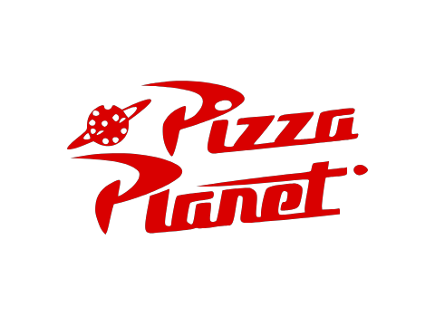
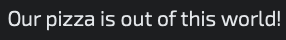

# Overview
This describes how I solve the problem presented to me, essentially how I planned and journaled my thought process for building this project.  

[Models and Attributes](#models-and-attributes) | [UI Design](#ui-design) 
### Summary
I decided to name the company Pizza Planet :alien::pizza: similar to the one seen in Pixar's Toy Story. (I'm a Disney/Pixar fan). Based on the requirements of the project, I am thinking of it as an interface for building a menu, such that customers would use this to order from inside or on the website. I am using the MVC (Model-View-Controller) architecture to build this application. The front end will be built using HTML, CSS, and Javascript. The backend will be built with Node.js, Express as the server component and Handlebars as the view engine. MongoDB is used as the database. 

<p align="center">

</p>

### Models and Attributes 
[Back to top](#overview) 

> Users - All of the people who will use this interface. This is exclusive to employees so there will need to be authentication. Duplicate users cannot exist. 
- `String` id: The unique ID created by the DBMS to identify a specific user record. 
- `String` username: The name that the user chose to create when they signed up. *(jpeoples)* 
- `String` fname: First name of the user *(Joshua)*
- `String` lname: Last name of the user *(Peoples)*
- `String` password: A hash encrypted version of the password the user chose to sign up. *(95cj34vo3453v95334)* 
- `String` permissions: Depending on the type of user it is, they will have different permissions. *(Owner or Chef)* 
- `String` profileimg: A route to the image of the user. *(/images/username.jpg)* 

> Toppings - The toppings that Pizza Planet :alien::pizza: has to offer for the pizzas it sells. These can only be created by users with permission: Owner. Duplicate toppings cannot exist. 
- `String` id: The unique ID created by the DBMS to identify a specific topping.
- `String` name: The name of the topping. *(Such as chicken or olives)* 
- `String` type: The type of topping. *(4 Types: Meat, Veggies, Sauce or Cheese)* 
- `Number` price: The cost to add the topping to a pizza *(1.50)* 
- `String` toppingimg: A route to the image of the topping. *(/images/topping.jpg)*  
- `String` createdby: The id of the user who created the topping in the database. *(users.id)*

> Pizzas - The selection of pizzas that customers will be able to choose from Pizza Planet's :alien::pizza: menu. These can only be created by users with permission: Chef. Duplicate pizzas cannot exist. 
- `String` id: The unique ID created by the DBMS to identify a specific pizza. 
- `String` name: The name of the pizza creation *(Meatlover's, Veggie, Hawaiian)* 
- `Object` toppings: The toppings chosen for a pizza.
For example, one pizza would be: ```{sauce: "tomato", cheese: ["mozzarella"], meat: [], veggies: ["olives", "banana peppers"]}```
- `String` description: The text accompanying a pizza to entice customers to purchase our delectable options.
- `Number` price: a base cost plus the cost of each topping on the pizza - calculated before the data is added collectively. *(12.99)* 
- `String` pizzaimg: A route to the image of the pizza. *(/images/pizza_name.jpg)*
- `String` createdby: The id of the user who created the topping in the database. *(users.id)*

## UI Design
[Back to top](#overview)  

I wanted to align the design with what inspired it, so I am drawing inspiration from the Toy Story movie. I used the below image (and other screenshots from the movie(s) as references to complete the design:

 

Given the nature of the source material, I'm using rounded borders, as well as incorporating organic shapes into the mix to make it more fun. 

### Color Palette 
- Primary:       #1e1f4e 
- Secondary:     #870d51
- Accent/Addtnl: #bc1a1f (For a border gradient look and sprinkled in certain areas)
- Text:          #13ab08 / #fff


### Typography 
> Google Fonts that I am using:
- Audiowide for header text:  
 

- Exo 2 (light 300) for body text:  
 

### Views  
> Login - The first page a user will see when trying to get into this system. 
- There is a form with Username and Password Inputs, a 'type' dropdown, and 'create account' and 'submit' buttons.
- Clicking 'create user' opens up the 'type' dropdown for selecting 'owner' or 'chef'.

> Dashboard - Once a user is authenticated, this is the page they are led into. Depending on the type of user, this page may look a little different. 
- A user of type 'chef' will have a button that says 'new pizza', and they can see all of the pizzas that have been made for customers to choose from. 
- A user of type 'owner' will have a button that says 'new topping', and they can see all of the toppings available for chefs to create new pizzas. 

Clicking 'new x' button will expand a form to add a new pizza or topping. Error messages are made visible if one of the error conditions is met. 

[Back to top](#overview) 
