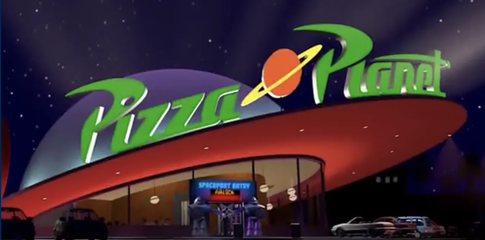
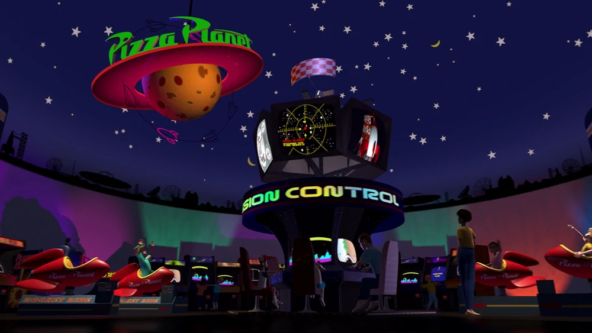

# Overview
This describes how I intend to solve the problem presented to me, essentially where I will plan and journal my thought process for building this project. 

## Summary
For the sake of nostalgia/emotional attachment, I decided to name the company Pizza Planet :alien::pizza: similar to the one seen in Pixar's Toy Story. (I'm a Disney/Pixar fan). Based on the requirements of the project, I'm thinking it is an interface for building a menu, such that customers would use this to order from inside or on the website.

### Models and Attributes

**Users** - All of the people who will use this interface. This is exclusive to employees so there will need to be authentication. Duplicate users cannot exist. 
- `type String` id: The unique ID created by the DBMS to identify a specific user record. 
- `type String` username: The name that the user chose to create when they signed up. *(jpeoples)* 
- `type String` password: A hash encrypted version of the password the user chose to sign up. *(95cj34vo3453v95334)* 
- `type String` permissions: Depending on the type of user it is, they will have different permissions. *(Admin or Chef)* 
- `type String` profileimg: A route to the image of the user. *(/images/username.jpg)* 

**Toppings** - The toppings that Pizza Planet :alien::pizza: has to offer for the pizzas it sells. These can only be created by users with permission: Admin. Duplicate toppings cannot exist. 
- `type String` id: The unique ID created by the DBMS to identify a specific topping.
- `type String` name: The name of the topping. *(Such as chicken or olives)* 
- `type String` type: The type of topping. *(4 Types: Meat, Veggies, Sauce or Cheese)* 
- `type Number` price: The cost to add the topping to a pizza *(1.50)* 
- `type String` toppingimg: A route to the image of the topping. *(/images/topping.jpg)*  

**Pizzas** - The selection of pizzas that customers will be able to choose from Pizza Planet's :alien::pizza: menu. These can only be created by users with permission: Chef. Duplicate pizzas cannot exist. 
- `type String` id: The unique ID created by the DBMS to identify a specific pizza. 
- `type String` name: The name of the pizza creation *(Meatlover's, Veggie, Hawaiian)* 
- `type Object` toppings: The toppings chosen for a pizza *(`{sauce: "tomato", cheese: ["mozzarella"], meat: [], veggies: ["olives", "spinach"]}`)* 
- `type Number` price: a base cost plus the cost of each topping on the pizza - calculated before the data is added collectively. *(12.99)* 
- `type String` pizzaimg: A route to the image of the pizza. *(/images/pizza_name.jpg)*

### Design Guide
I want to align the design to what inspired it, so I am drawing inspiration from the Toy Story movie. I am using the below images as a reference to complete the design:

  

**Color Pallette**

--Routes goes here--