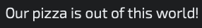

# Overview
This describes how I solve the problem presented to me, essentially how I planned and journaled my thought process for building this project. You can view the live deployed version on https://pizzaplanet-sm.herokuapp.com.

The username for a chef is `testchef` and the password is `pizzaplanet`
The username for the owner is `testowner` and the password is `pizzaplanet`

[Downloading and Running Locally](#downloading-and-running-locally) | [Models and Attributes](#models-and-attributes) | [UI Design](#ui-design) | [Misc](#misc)
### Summary
I decided to name the company Pizza Planet :alien::pizza: similar to the one seen in Pixar's Toy Story. Based on the requirements of the project, I thought of it as an interface for building a menu, such that customers would use this from a different view to order from inside or on the website. I used the MVC (Model-View-Controller) architecture to build this application. The front end was built using HTML, CSS, and Javascript. The backend was built with Node.js, Express as the server component and EJS as the view engine. MongoDB is used as the database. Mongoose is the library that connects to the MongoDB database.

### Downloading and Running Locally

To run this program locally, you need to first download the packages. You can do so in the console by typing `npm i.` You also need to create a `.env` file, which is included as one of the packages when you run `npm i` There are 3 variables from the `.env` that are used in the server but only 2 of them are required to run this. 

- (Required) You need MongoDB to run the database. **This is important:** In MongoDB Atlas, create a database inside your cluster called 'pizzaplanetsm'. In the downloaded project, Create a variable in the `.env` called `MONGODB_URL` and save the url to that variable to connect.
https://www.mongodb.com/docs/atlas/create-connect-deployments/

- (Required) You need a session secret for user authentication.
- (optional) You can provide a PORT variable, but the code is set to use port 3000 if no port is specified in the `.env`.

The program is set up to run tests using the Jest framework. You can enter tests and run them in the respective files. (server.test.js and create.test.js). Run tests using `npm test`. There is also the Wallaby extension if you use VS code, which accompanies Jest for testing-as-you-code.

There is a variable you need to change in `server.js` called "sessionStore." You just need to change the `dbName` variable so that the value is `pizzaplanetsm`. The original value is for the deployed database.

Finally, run the software by typing `npm run dev`. This is setup using the nodemon package, so any changes you make and save will automatically reboot the server. You can also use `npm run prod` to run without nodemon if you're a true chad.

### User Roles

There are two user roles: Chef and Owner. You will need to create a user for both roles, it is not built for the owner to access the ability to create pizzas. 

A chef can see all of the pizzas, create them, edit them, and delete them.

Creating an owner opens a field for the [Admin Key](#misc). More information on that below. The owner creates the toppings, which includes setting a name, a price, and a type. 

### Models and Attributes 
[Back to top](#overview) 

The image fields for these data models are randomly selected. For toppings, they're chosen based on type. Pizzas is 100% random, but I didn't want to go image-less, that's ug. 

> Users - All of the people who will use this interface. This is exclusive to employees so there will need to be authentication. Duplicate users cannot exist. 
- `String` id: The unique ID created by the DBMS to identify a specific user record. 
- `String` username: The name that the user chose to create when they signed up. *(jpeoples)* 
- `String` fname: First name of the user *(Joshua)*
- `String` lname: Last name of the user *(Peoples)*
- `String` password: The password the user chose to sign up. *(1kn0wwh4ty0ud1dl4stn1ght)* 
- `String` permissions: Depending on the type of user it is, they will have different permissions. *(owner or chef)* 

> Toppings - The toppings that Pizza Planet :alien::pizza: has to offer for the pizzas it sells. These can only be created by users with permission: Owner. Duplicate toppings cannot exist. 
- `String` id: The unique ID created by the DBMS to identify a specific topping.
- `String` name: The name of the topping. *(Such as chicken or olives)* 
- `String` type: The type of topping. *(4 Types: Meat, Veggies, Sauce or Cheese)* 
- `Number` price: The cost to add the topping to a pizza *(1.50)* 
- `String` img: A route to the image of the topping. *(/images/topping.png)*  
- `String` users: The id of the user who created the topping in the database. *(users.id)*

> Pizzas - The selection of pizzas that customers will be able to choose from Pizza Planet's :alien::pizza: menu. These can only be created by users with permission: Chef. Duplicate pizzas cannot exist. 
- `String` id: The unique ID created by the DBMS to identify a specific pizza. 
- `String` name: The name of the pizza creation *(Meatlover's, Veggie, Hawaiian)* 
- `Array`  toppings: The toppings chosen for a pizza.
- `String` description: The text accompanying a pizza to entice customers to purchase our delectable options.
- `Number` price: a base cost plus the cost of each topping on the pizza - calculated before the data is added collectively. *(12.99)* 
- `String` img: A route to the image of the pizza. *(/images/pizza_name.jpg)*
- `String` users: The id of the user who created the topping in the database. *(users.id)*

## UI Design
[Back to top](#overview)  

I wanted to align the design with what inspired it, so I am drawing inspiration from the Toy Story movie. I used the below image (and other screenshots from the movie(s) as references to complete the design:

 

Given the nature of the source material, The design is a lot more fun and less serious. It's a pizza-arcade kind of like Chuck E Cheese's (do those still exist?)

### Color Palette 
I mostly used these colors and slight variations where applicable. 
- #1e1f4e 
- #870d51
- #bc1a1f (For a border gradient look and sprinkled in certain areas)
- #13ab08 / #fff

### Typography 
> Google Fonts that I am using:
- Audiowide for header text:  
 

- Exo 2 (light 300) for body text and smaller headers:  
 

### Views  
> Login - The first page a user will see when trying to get into this system. If a user is not authenticated, they will be redirected here.
- There is a form with Username and Password Inputs, and 'create account' and 'submit' buttons.
- Incorrect login credentials redirect you to the **Error** view. 
- Clicking 'create user' renders 'newuser' page for adding your name, creating a user and passphrase, and selecting 'owner' or 'chef'.

> Dashboard - Once a user is authenticated, this is the page they are led into. Depending on the type of user, this page will look a little different. 
- A user of type 'chef' will have a button that says 'new pizza', and they can see all of the pizzas that have been made for customers to choose from. 
- A user of type 'owner' will have a button that says 'new topping', and they can see all of the toppings available for chefs to create new pizzas. 
- Every record that is listed will have buttons for creating, updating, and deleting them. The create and update buttons lead to the **Create** page on toppings. For pizzas, creating and updating happens on the same dashboard.  
- If the user is not authenticated, they are redirected to the **Login** page.

> Create - When a user clicks on the 'create' or 'update' buttons on the dashboard, this is the page that will be rendered. 
- The create button simply opens the page (popup on the pizza dashboard)
- The update button will pass in the ID of the topping or pizza to the page and the most current information in the database will be filled in. 
- Before submitting the form, if there is already a record of the topping or pizza, then the user is redirected to the **Error** page. This includes duplicates by name, and if you're talking pizza, then it even checks for duplicate topping combinations--that's the same pizza! 

> Error - This is a page that is rendered when any of the above mentioned views encounters an issue. 
- This page describes the issue and provides a button to redirect the user back to the previous page. 

### Misc
[Back to top](#overview) 
> Note there is an 'Admin Key' that pops up when trying to create a 'new user - owner.' This admin key is arbitrary and you can put in any input and it will work. Just a proof of concept. 
> There are additional features scattered throughout the system. My favorite to work on was the logic for duplicate toppings in pizzas. 
